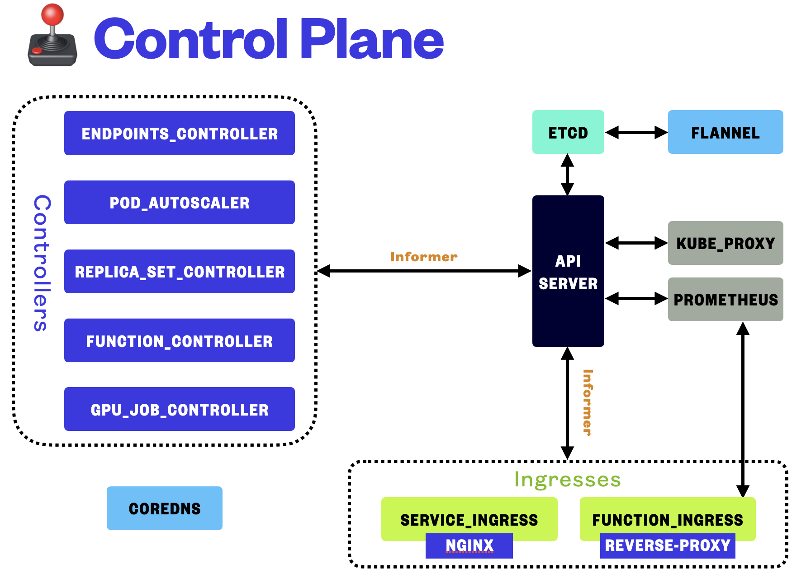
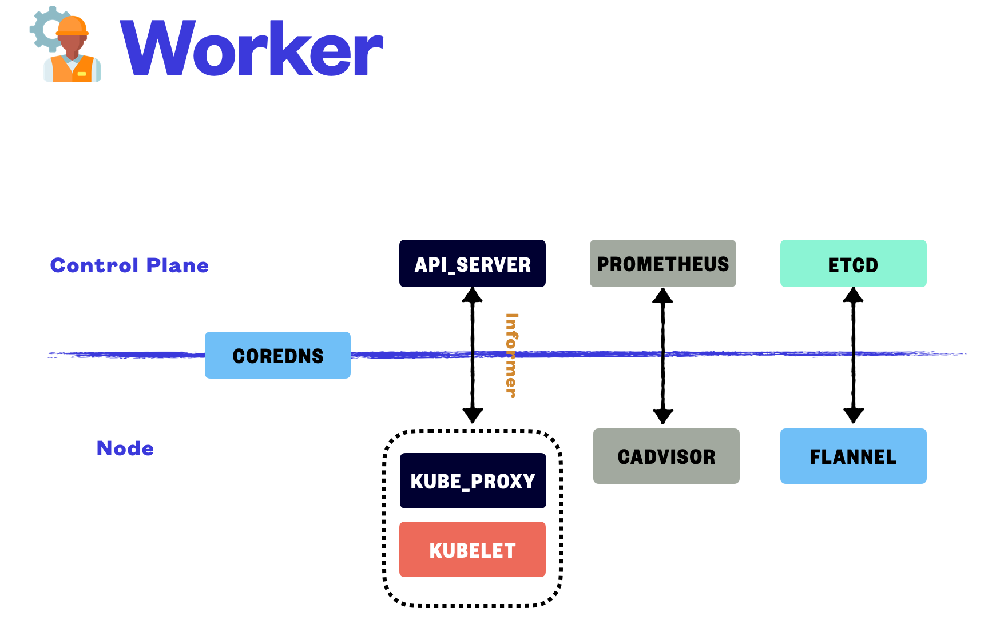

# rMiniK8s

A simple containerized application manage system like Kubernetes, but written in Rust.

Course Project for SJTU-SE3356, 2022.

## Architecture Overview

Refer to [Doc](assets/Doc.pdf) and [Pre](assets/Pre.pdf) for further information.

## Getting Started

Use `./scripts/ARCH/master/up.sh` to deploy the control plane and `./scripts/ARCH/node/up.sh` to deploy a node. Only ARM architecture is supported and tested currently.

P.S. You may want to build the dependencies(docker images, binaries) and set up a local registry first. Refer to the script for further information.

## License

This project is licensed under the [GPL license].

[GPL license]: https://github.com/markcty/rMiniK8s/blob/main/LICENSE
